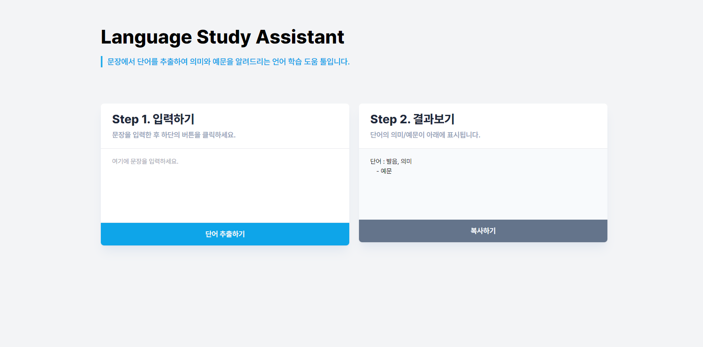

# Language Study Assistant

KO | [JP](README-jp.md)

[https://energneer.github.io/language-study-assistant/](https://energneer.github.io/language-study-assistant/)



## 프로젝트 개요

Language Study Assistant는 언어 학습을 위한 웹 애플리케이션입니다. 사용자가 입력한 문장에서 핵심 단어를 추출하고, 이 단어들의 의미와 사용 예문을 제공하여 언어 학습 과정을 간소화하고 효율화합니다. 이 프로젝트는 AWS Lambda를 활용한 서버리스 백엔드 아키텍처와 GitHub Pages를 통한 프론트엔드 배포, 그리고 GitHub Actions를 이용한 CI/CD 파이프라인 구축을 특징으로 합니다.

## 프로젝트를 시작하게 된 계기

평소에 일어와 영어 공부를 할 때 천성인어와 CNN 뉴스를 활용하고 있었는데, 하나하나의 단어와 뜻, 특히 일본어의 경우 발음을 찾는 작업이 번거로웠습니다. 그러던 와중 우연히 Chat GPT를 이용하여 단어의 뜻과 독음을 알려달라고 요청했더니 결과가 매우 만족스러웠습니다. 특히, 파파고와 달리 세세한 단어까지 모두 표시되지 않아 단어를 골라내는 번거로움이 거의 없었습니다. 이거다! 싶어서 바로 토이 프로젝트를 시작하게 되었습니다. 추가 기능을 고민하던 중 동생의 의견을 반영하여 예문을 알려주는 기능도 추가했습니다. 앞으로도 자기만족용으로 더 많은 기능을 추가하고자 하며, React와 TypeScript로 마이그레이션하려고 합니다.

## 기능 소개

- **언어 자동 감지**: franc-min 라이브러리를 사용하여 사용자 입력에서 언어를 자동으로 감지합니다. 이를 통해 해당 언어에 맞는 처리를 수행합니다.
- **핵심 단어 추출 및 의미 제공**: 입력된 문장에서 핵심 단어를 추출하고, 해당 단어의 발음기호 및 의미를 제공합니다.
- **사용 예문 제공**: 각 핵심 단어에 대해 사용 예문을 제공함으로써, 단어가 실제 문장에서 어떻게 쓰이는지를 이해할 수 있습니다.
- **다국어 지원**: 다양한 언어의 문장을 처리할 수 있으며, 사용자에게는 감지된 언어에 맞는 응답을 제공합니다.

## 개선 예정 사항

[**Project Dashboard**](https://energneer.notion.site/Project-Dashboard-bac02eb446244eebb70dc36f207b4c74)

- **다국어 지원**: 사용자의 브라우저 언어를 자동으로 감지하여, 해당 언어로 페이지와 API 응답을 제공하도록 조건문을 추가합니다.
- **로딩 인디케이터 변경**: 현재는 원형 로딩 인디케이터를 사용하여 서버 응답 대기 시간이 길게 느껴질 수 있습니다. 이를 진행 상태를 보여주는 진행바로 변경하여 사용자가 작업이 진행 중임을 더 명확히 인지할 수 있도록 할 예정입니다.
- **입력 가능한 남은 글자 수 표시**: 사용자가 몇 글자를 더 입력할 수 있는지 알려주는 UI 요소를 추가할 예정입니다.
- **모바일 UI 최적화**: 모바일 사용자 경험을 개선하기 위해 마진과 레이아웃을 조정합니다.
- **현재 입력 중인 언어 표시**: franc-min 라이브러리를 사용해 현재 입력 중인 언어를 자동으로 감지하고 표시합니다. 언어 감지가 실패한 경우, 사용자가 API 호출을 시도하지 않도록 합니다.
- **결과 공유 기능**: 사용자가 결과를 쉽게 공유할 수 있도록 공유 버튼을 추가합니다.

## 技術スタック

- **Backend**: Node.js, AWS Lambda
- **Frontend**: HTML, Tailwind CSS, JavaScript
- **Deployment**: GitHub Pages, AWS Lambda
- **CI/CD**: GitHub Actions
- **Other Libraries**: Axios, franc-min, dotenv

## 설치 및 실행 방법

### 로컬 환경에서 실행하기

```bash
git clone https://github.com/yourusername/gpt-language-learning.git
cd gpt-language-learning
npm install
npm start
```

### AWS Lambda 설정

AWS Lambda 함수를 생성하고, `handler.js`를 기반으로 함수를 설정합니다. 함수 배포 과정을 위해 root에 `lambdaHandler.js` 파일을 두어 `handler.js`를 호출합니다.

### GitHub Actions를 이용한 CI/CD

`deploy.yml` 파일을 `.github/workflows/` 디렉토리에 추가하여 Main 브랜치에 변경 사항이 push될 때마다 프론트엔드가 자동으로 빌드되고 GitHub Pages로 배포됩니다.

## 사용 예시 및 코드 스니펫

### 언어 감지 - franc-min

```javascript
import { franc } from "franc-min";

export const detectLanguage = (text) => {
  const detectedLanguage = franc(text, { minLength: 3 });
  return detectedLanguage;
};
```

### AWS Lambda - 핸들러 함수

```javascript
export const handler = async (event) => {
  try {
    const userInput = JSON.parse(event.body).userInput;
    const answer = await processChatGPTRequest(userInput);
    console.log("ChatGPT API 응답:", answer);
    return {
      statusCode: 200,
      body: JSON.stringify({ answer }),
    };
  } catch (error) {
    console.error("ChatGPT API 요청 실패:", error.message);
    return {
      statusCode: 500,
      body: JSON.stringify({ error: "ChatGPT API 요청 실패" }),
    };
  }
};
```

### GitHub Actions - 배포 자동화

```yaml
name: Deploy to GitHub Pages

on:
  push:
    branches:
      - master

jobs:
  build-and-deploy:
    runs-on: ubuntu-latest
    steps:
      - name: Checkout
        uses: actions/checkout@v4

      - name: Set up Node.js
        uses: actions/setup-node@v4
        with:
          node-version: "20"

      - name: Deploy to gh-pages
        uses: peaceiris/actions-gh-pages@v3
        with:
          github_token: ${{ secrets.GITHUB_TOKEN }}
          publish_dir: ./public
```

## 프로젝트 구조

```
language-study-assistant/
├── .github/
│   └── workflows/
│       └── deploy-to-gh-pages.yml  # GitHub Actions 설정 파일
├── public/
│   ├── index.html                 # 웹 페이지의 HTML 파일
│   ├── main.js                    # 웹 페이지의 주요 JavaScript 파일
│   └── style.css                  # 최종 웹 페이지의 스타일을 정의하는 CSS 파일
├── server/
│   ├── chatGPTModule.js           # ChatGPT 모듈 (언어 감지 및 메시지 포맷팅 기능 포함)
│   ├── languageDetection.js        # 언어 감지 모듈
│   ├── messageFormatting.js        # 메시지 포맷팅 모듈
│   ├── processChatGPTRequest.js   # ChatGPT API 요청 처리 모듈
│   ├── server.js                  # 개발용 Express 서버
│   └── lambda/
│       └── handler.js             # AWS Lambda 핸들러 함수
├── src/
│   ├── dev/
│   │   ├── input.css              # TailwindCSS로 스타일링된 입력 UI용 CSS 파일
│   │   └── output.css             # TailwindCSS로 스타일링된 결과 UI용 CSS 파일
│   ├── utils/
│   │   ├── inputHandlers.js       # 입력 UI 이벤트 핸들링 및 처리 모듈
│   │   └── uiUtils.js             # 사용자 인터페이스(UI) 관련 유틸리티 함수 모듈
├── .env                            # 환경 설정 파일
├── package.json                    # npm 설정 파일
└── README.md                       # 프로젝트 설명

```
